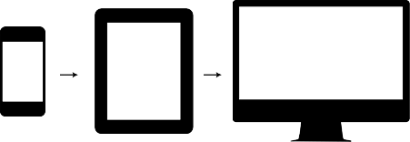
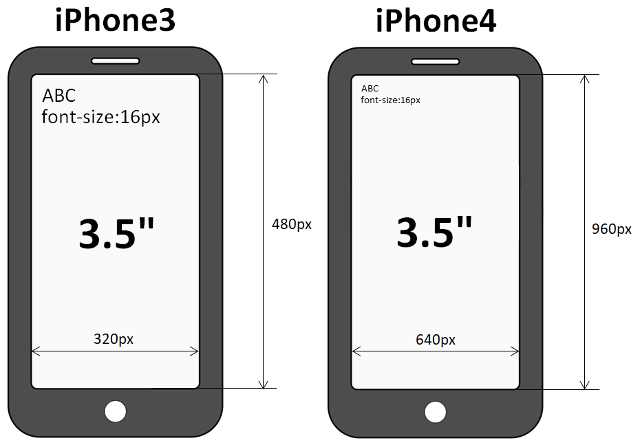

# Адаптивная верстка

::: details Темы
- Адаптивная верстка
- Мобильная версия сайта
:::


<!-- xxxxxxxxxxxxxxxxxxxxxxxxxxxxxxxxxxxxxxxxxxxxxxxxxxxxxxx -->
### Стандартные разрешения экрана
<!-- xxxxxxxxxxxxxxxxxxxxxxxxxxxxxxxxxxxxxxxxxxxxxxxxxxxxxxx -->
- `1200px` - Large Devices, Wide Screens
- `1024px` - Medium Devices, Desktops
- `992px` - Medium Devices, Desktops
- `768px` - Small Devices, Tablets
- `640px` - Small Devices, Tablets
- `480px` - Extra Small Devices, Phones
- `320px` - Custom, iPhone Retina


<!-- xxxxxxxxxxxxxxxxxxxxxxxxxxxxxxxxxxxxxxxxxxxxxxxxxxxxxxx -->
### CSS Media queries
<!-- xxxxxxxxxxxxxxxxxxxxxxxxxxxxxxxxxxxxxxxxxxxxxxxxxxxxxxx -->
- Если верстам: `pc` -> `tablet` -> `mobile` (концепция `Desktop First`)


```css:no-line-numbers
@media screen and (max-width: 1200px) {
    /* Eсли ширина экрана стала меньше 1200px, применяются свойства, написанные здесь */
}
```

- Если верстам: `mobile` -> `tablet` -> `pc` (концепция `Mobile First`)



```css:no-line-numbers
@media screen and (min-width: 700px) {
    /* Eсли ширина экрана стала больше 700px, применяются свойства, написанные здесь */
}
```


<!-- xxxxxxxxxxxxxxxxxxxxxxxxxxxxxxxxxxxxxxxxxxxxxxxxxxxxxxx -->
### Примеры
<!-- xxxxxxxxxxxxxxxxxxxxxxxxxxxxxxxxxxxxxxxxxxxxxxxxxxxxxxx -->

<!------------------------------------------------------------->
#### Desktop First
<!------------------------------------------------------------->
<v-iframe
    height="370"
    src="https://codepen.io/Sergeenkov/embed/aKmdvP?height=373&theme-id=default&default-tab=css,result"
/>

<!------------------------------------------------------------->
#### Mobile First
<!------------------------------------------------------------->
<v-iframe
    height="370"
    src="https://codepen.io/Sergeenkov/embed/ZRpvwV?height=265&theme-id=default&default-tab=css,result"
/>

<!------------------------------------------------------------->
### Meta Viewport
<!------------------------------------------------------------->
```html:no-line-numbers
<meta name="viewport" content="width=device-width, initial-scale=1">
```

- `Viewport` - видимая пользователю область страницы (то, что может увидеть пользователь, не прибегая к прокрутке)
- `Метатег Viewport` - был разработан компанией Apple для того, чтобы указывать браузерам на то, в каком масштабе необходимо отображать пользователю видимую область веб-страницы. Он предназначен для того, чтобы веб-страницы отображались корректно на смартфонах, планшетах и других устройствах с высокой плотностью пикселей (>200ppi)

```html:no-line-numbers
<meta
	name="viewport"
	content="
		width=device-width,
		initial-scale=1.0,
		minimal-scale=1.0,
		maximal-scale=1.0,
		user-scalable=no
	"
>
```

<!------------------------------------------------------------->
#### Параметры
<!------------------------------------------------------------->
- `width=device-width` - соотношение ширины видимой области веб-страницы с CSS шириной устройства
- `initial-scale=1.0` - первоначальный масштаб веб-страницы (1.0 == 100%)
- `minimal-scale=1.0` - задаёт минимальный масштаб
- `maximal-scale=1.0` - устанавливает максимальный масштаб
- `user-scalable=no` - указывает, может ли пользователь управлять масштабом

<!------------------------------------------------------------->
#### `width=device-width`
<!------------------------------------------------------------->
- `width=device-width` отвечает за то, чтобы <u>ширина видимой области веб-страницы</u> равнялась <u>CSS ширине устройству</u> (device-width). CSS ширина устройства - это не физическое разрешение экрана. Это некоторая величина независящая от разрешения экрана. Она предназначена для того, чтобы мобильный адаптивный дизайн сайта отображался на всех устройствах одинаково независимо от их плотности пикселей экрана
- Н-р, смартфон iPhone 4 с физическим разрешением 640x960 имеет CSS разрешение 320x480. Это означает то, что сайт с метатегом viewport (width=device-width) на этом устройстве будет выглядить так как будто бы это устройство имеет разрешение 320x480 (в данном случае вместо device-width будет подставляться значение 320px). Т.е. на один CSS пиксель будет приходиться 4 физических пикселя (2 по горизонтали и 2 по вертикали)




<v-two>
<template v-slot:first>
<ul>
    <li><b>Apple iPhone 3</b></li>
    <li><u>Диагональ</u> 3.5"</li>
    <li><u>Плотность пикселей</u> 163ppi</li>
    <li><u>Физическое разрешение</u> 320x480</li>
    <li>Такое разрешение соответствует диагонали, если его сопоставить с разрешением мониторов настольных устройств (компьютеров)</li>
    <li>Т.е. на веб-странице этого смартфона, текст, выполненный размером 16px, будет также хорошо читаемым как на мониторе компьютера</li>
</ul>
</template>
<template v-slot:last>
<ul>
    <li><b>Apple iPhone 4</b></li>
    <li><u>Диагональ</u> 3.5"</li>
    <li><u>Плотность пикселей</u> 326ppi</li>
    <li><u>Физическое разрешение</u> 640x960</li>
    <li>Более высокое разрешение при тех же размерах экрана</li>
    <li>Это приведёт к тому, что тот же самый текст и остальные объекты веб-страницы будут выглядеть в нём при тех же условиях в 2 раза меньше</li>
    <li>Таким образом, текст будет реально выглядеть на 8px</li>
    <li>Чтобы сделать эту страницу пригодной для чтения, её представление необходимо увеличить в горизонтальном и вертикальном направлении в 2 раза (отмасштабировать)</li>
</ul>
</template>
</v-two>
