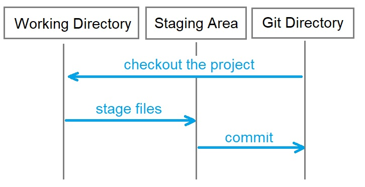
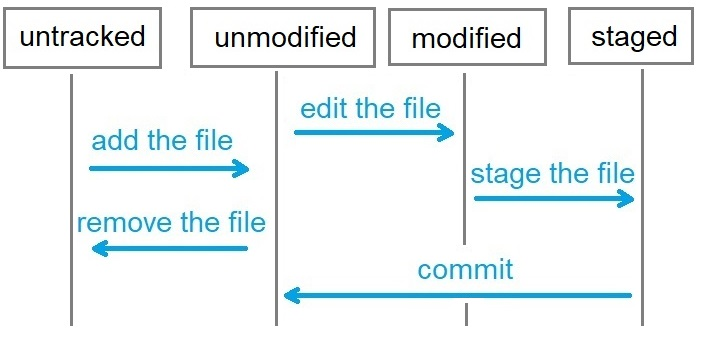

# Принцип работы

<!-- xxxxxxxxxxxxxxxxxxxxxxxxxxxxxxxxxxxxxxxxxxxxxxxxxxxxxxx -->
### Статусы файлов
<!-- xxxxxxxxxxxxxxxxxxxxxxxxxxxxxxxxxxxxxxxxxxxxxxxxxxxxxxx -->
1. `Untracked` - после добавления нового файла
2. `Staged` - после git add
3. `Modified` - после изменения существующего файл
4. `Commited` - после git commit

<!-- xxxxxxxxxxxxxxxxxxxxxxxxxxxxxxxxxxxxxxxxxxxxxxxxxxxxxxx -->
### Области
<!-- xxxxxxxxxxxxxxxxxxxxxxxxxxxxxxxxxxxxxxxxxxxxxxxxxxxxxxx -->
1. `Working Directory` - рабочий каталог
2. `Staging Area` - область подготовленных файлов
3. `Git Directory` (Repository) - каталог git

<!-- xxxxxxxxxxxxxxxxxxxxxxxxxxxxxxxxxxxxxxxxxxxxxxxxxxxxxxx -->
### Жизненный цикл файлов
<!-- xxxxxxxxxxxxxxxxxxxxxxxxxxxxxxxxxxxxxxxxxxxxxxxxxxxxxxx -->
- Файл в Working Directory может находиться под версионным контролем (`unmodified`, `modified`, `staged`) и неотслеживаемые файлы (`untracked`)

