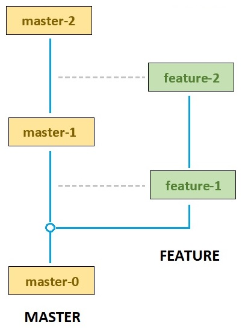
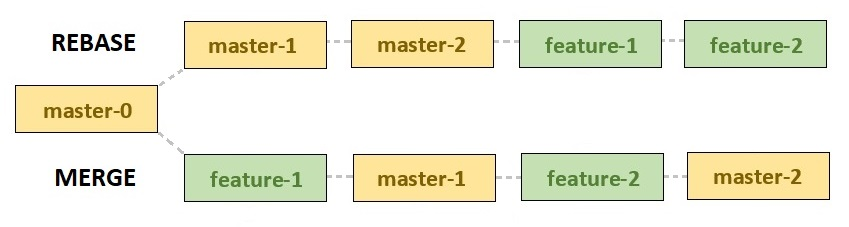

# Merge vs Rebase

### Сравнение merge и rebase

<table class="half-width no-even" width="750px">
    <tr>
        <th>merge</th>
        <th>rebase</th>
    </tr>
    <tr>
        <td colspan="2" class="accent">История коммитов</td>
    </tr>
    <tr>
        <td>
            <ul>
                <u>История коммитов нелинейная</u>
                <li>Есть merge-коммиты, которые указывают сразу на 2 или больше коммитов</li>
                <li>Merge не меняет историю: поверх всех коммитов, которые были в ветке, добавляется еще 1 коммит с изменениями из "develop"</li>
            </ul>
        </td>
        <td>
            <ul>
                <u>История коммитов линейная</u>
                <li>Rebase меняет историю: меняются все хеши коммитов</li>
            </ul>
        </td>
    </tr>
    <tr>
        <td>
            <ul class="list-point">
                <li>Сохраняет историю коммитов</li>
            </ul>
        </td>
        <td>
            <ul class="list-point">
                <li>Не сохраняет историю коммитов</li>
            </ul>
        </td>
    </tr>
    <tr>
        <td colspan="2" class="accent">merge-коммит</td>
    </tr>
    <tr>
        <td>
            <ul class="list-point">
                <li>Добавляется</li>
            </ul>
        </td>
        <td>
            <ul class="list-point">
                <li>Не добавляется</li>
            </ul>
        </td>
    </tr>
    <tr>
        <td colspan="2" class="accent">Правка конфликтов</td>
    </tr>
    <tr>
        <td>
            <ul class="list-point">
                <li>Один раз</li>
            </ul>
        </td>
        <td>
            <ul class="list-point">
                <li>Для каждого коммита</li>
            </ul>
        </td>
    </tr>
</table>

### Сравнение истории коммитов для Rebase и Merge

#### Исходные даннные: порядок коммитов

<v-two>
<template v-slot:first>

</template>
<template v-slot:last>

1. `master-0` - master
2. `feature-1` - feature
3. `master-1` - master
4. `feature-2` - feature
5. `master-2` - master

</template>
</v-two>

### История коммитов для Rebase и Merge
- `merge` - (слияние) - хронологический порядок
- `rebase` - (перемещение) - у новых коммитов изменится хеш и они будут поверх старых

