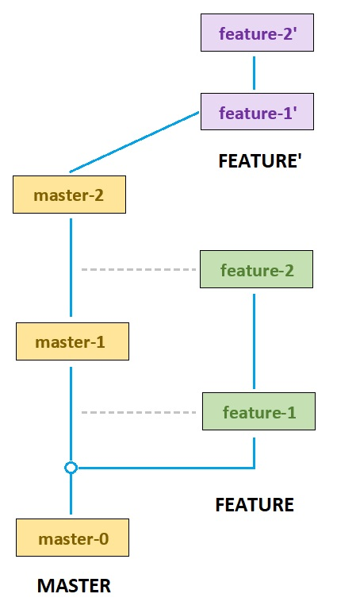

# Перемещение веток (rebase)

### Описание
- `rebase` позволяет взять все коммиты из одной ветки и применить их поверх другой
- Выполняет работу аналогичную cherry-pick, только для цепочки коммитов, перенося ветку на новое место
- Коммит, который не даёт изменений называется пустым. rebase автоматически пропускает этот коммит

### `rebase`
```bash:no-line-numbers:no-line-numbers
git rebase master      # rebase
git rebase --continue  # продолжить rebase (вызывается при наличии конфликтов)
git rebase --skip      # пропустить коммит (вызывается при наличии конфликтов)
git rebase --abort     # отменить rebase (возвращает обратно HEAD - не изменит историю коммитов)
```

<v-details title="git rebase --continue">

Флаг `--continue` позволяет продолжить rebase после фикса конфликта и перейти к следующему коммиту

```bash:no-line-numbers:no-line-numbers
# Rebase develop в текущую ветку
git rebase develop

# Если есть конфликт, то открывается редактор для фикса
# После фикса добавляются изменения в staged
git add .

# Продолжить Rebase и перейти к следующему коммиту
git rebase --continue

# Откроется редактор, где можно изменить название коммита
# После закрытия редактора Rebase перейдет к следующему коммиту
# Если следующего коммита нет, то Rebase завершится
```

</v-details>

<v-details title="git rebase --skip">

Флаг `--skip` позволяет пропустить коммит из текущей ветки и взять изменения из *develop*

```bash:no-line-numbers:no-line-numbers
# Rebase develop в текущую ветку
git rebase develop

# Если есть конфликт, то открывается редактор для фикса
# Пропустить коммит из текущей ветки и перейти к следующему коммиту
git rebase --skip
```

</v-details>

<v-details title="git rebase --abort">

Флаг `--abort` позволяет вернусть состояние текушей ветки до rebase.  
Маркер HEAD, будет перенесен обратно на текущую, а уже добавленные коммиты повиснут в воздухе (на них не будет указывать ни один указатель) и будут вскоре удалены.

```bash:no-line-numbers:no-line-numbers
# Rebase develop в текущую ветку
git rebase develop

# Если есть конфликт, то открывается редактор для фикса
# Откатиться в состояние до rebase
git rebase --abort
```

</v-details>


### Интерактивный rebase

### `rebase -i`
```bash:no-line-numbers:no-line-numbers
# Интерактивный rebase на другую ветку
git rebase -i master
# Интерактивный rebase внутри ветки (изменить историю последних 3х коммитов)
git rebase -i HEAD~3
```

- В начала rebase запустится окно редактора, где можно указать определенную команду для каждого коммита
- При этом переписывается история коммитов - у каждого коммита будет новый хеш

#### Команды
- `pick`   (p) - использовать коммит без изменений (по умолчанию)
- `reword` (r) - использовать текущий коммит с возможностью изменения сообщения коммита
- `drop`   (d) - удаление коммита (вместо этого можно удалить строку с коммитом)
- `fixup`  (f) - будет объединен с предыдущем коммитом в списке, но без изменения сообщения коммита
---
- `squash` (s) - будет объединен с предыдущем коммитом в списке
- `edit`   (e) - отредактировать коммит (когда git дойдёт до коммита, выполнится отстановка и git предложит выполнить действия)
- `exec`   (x) - выполнить скрипт для указанного коммита
- `break`  (b) - остановиться здесь (продолжить rebase позже с 'git rebase --continue')
- `label`  (l) - добавить метку для текущего HEAD с заданным именем
- `reset`  (t) - сбросить HEAD до указанной метки
- `merge`  (m) - создать merge-commit, используя message исходного merge-commit (или однострочный, если исходный merge-commit не был указан)


### Алгоритм работы

- Задача: загрузить изменения из *master* в *feature*

<v-two>
<template v-slot:first>

::: tip 0. Подготовка
Создание ветки *feature* и добавление коммитов в *master* и *feature*
:::
- *feature* откалывается от *master*
- В каждую ветку поочередно добавляются коммиты

**Порядок коммитов**
1. `master-0` - master
2. `feature-1` - feature
3. `master-1` - master
4. `feature-2` - feature
5. `master-2` - master

::: tip 1. Rebase
Создание новой ветки *feature'*
:::
- Создается новая временная ветка *feature'* на основе актуального состояния *master*

::: tip 2. Rebase
Копирование всех коммитов *feature* поверх текущей вершины *master* для временной ветки *feature'*
:::
- Работает аналогично cherry-pick: последовательно берутся изменения каждого коммита из *feature* и применяются к вершине *master*: для каждого из коммитов в *feature* берётся его дельта и сохраняется во временный файл
- Из каждого временного файла создается новый коммит с тем же автором и описанием, но другим хешем

::: tip 3. Rebase
Перенос HEAD из ветки *feature* в ветку *feature'*
:::
- После копирования коммитов, ссылка *feature* переносится на вершину новосозданной ветки *feature'*
- Теперь ветка *feature'* (копия ветки *feature*) основана на последнем состоянии *master*

</template>
<template v-slot:last>

</template>
</v-two>

---

### Задание
::: details Пункты
1. Перейти на ветку **master**
    - `git checkout master`
    - (если вы уже на ветке **master**, то выполнять не нужно)
2. Создать ветку от **master**
    - `git checkout -b feature`, где `feature` - название ветки
    - (команду необходимо выполнять находясь в ветке **master**)
3. Добавить 1 коммит в ветку **feature**
    - Добавить новый файл
    - `git add .`
    - `git commit -m 'Message'`
4. Вернуться на ветку **master**
    - `git checkout master`
5. Добавить 1 коммит в **master**
    - Аналогично как для **feature**
6. Вернуться на ветку **feature**
    - `git checkout feature`
7. Актуализировать ветку **feature** с **master**
    - Необходимо взять последние изменения с **master** и добавить в **feature**
    - `git rebase master`
8. Устранение конфликтов rebase
    - Конфликты могут возникнуть, если изменения коснулись одинаковых файлов в **master** и **feature**
    - При этом IDE (VSCode в моём случае) подсветит конфликтные файлы
    - `git add .` - добавить измеенные файлы в staged
    - `git rebase --continue` - если несколько коммитов, то преходим к фиксу следующего коммита
:::
