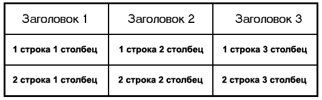
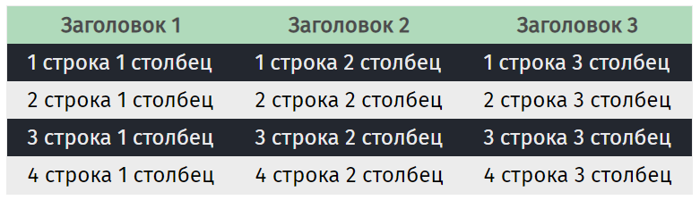

# Таблицы


<!-- xxxxxxxxxxxxxxxxxxxxxxxxxxxxxxxxxxxxxxxxxxxxxxxxxxxxxxx -->
### Теги
<!-- xxxxxxxxxxxxxxxxxxxxxxxxxxxxxxxxxxxxxxxxxxxxxxxxxxxxxxx -->
- `<table>` - Контейнер
- `<tr>` - Table Row (строка)
- `<td>` - Table Data (ячейка)
- `<th>` - Table Header (ячейка заголовка)
- `<td rowspan="2">` - Объединение строк
- `<td colspan="2">` - Объединение столбцов


<!-- xxxxxxxxxxxxxxxxxxxxxxxxxxxxxxxxxxxxxxxxxxxxxxxxxxxxxxx -->
### Пример таблицы
<!-- xxxxxxxxxxxxxxxxxxxxxxxxxxxxxxxxxxxxxxxxxxxxxxxxxxxxxxx -->


```html:no-line-numbers
<table>
	<tr>
		<th>Заголовок 1</th>
		<th>Заголовок 2</th>
		<th>Заголовок 3</th>
	</tr>
	<tr>
		<td>1 строка 1 столбец</td>
		<td>1 строка 2 столбец</td>
		<td>1 строка 3 столбец</td>
	</tr>
	<tr>
		<td>2 строка 1 столбец</td>
		<td>2 строка 2 столбец</td>
		<td>2 строка 3 столбец</td>
	</tr>
</table>
```

```css:no-line-numbers
table {
    border: 2px solid orange;
    border-collapse: collapse;
}
td, th {
    border: 2px solid orange;
    padding: 5px 10px;
}
```


<!-- xxxxxxxxxxxxxxxxxxxxxxxxxxxxxxxxxxxxxxxxxxxxxxxxxxxxxxx -->
### Объединение строк: `rowspan`
<!-- xxxxxxxxxxxxxxxxxxxxxxxxxxxxxxxxxxxxxxxxxxxxxxxxxxxxxxx -->


```html:no-line-numbers
<table>
    <tr>
        <th>Заголовок 1</th>
        <th>Заголовок 2</th>
        <th>Заголовок 3</th>
    </tr>
    <tr>
        <td rowspan="2">1 строка 1 столбец</td>
        <td>1 строка 2 столбец</td>
        <td>1 строка 3 столбец</td>
    </tr>
    <tr>
        <!--<td>2 строка 1 столбец</td>-->
        <td>2 строка 2 столбец</td>
        <td>2 строка 3 столбец</td>
    </tr>
</table>
```


<!-- xxxxxxxxxxxxxxxxxxxxxxxxxxxxxxxxxxxxxxxxxxxxxxxxxxxxxxx -->
### Объединение столбцов: `colspan`
<!-- xxxxxxxxxxxxxxxxxxxxxxxxxxxxxxxxxxxxxxxxxxxxxxxxxxxxxxx -->


```html:no-line-numbers
<table>
    <tr>
        <th>Заголовок 1</th>
        <th>Заголовок 2</th>
        <th>Заголовок 3</th>
    </tr>
    <tr>
        <td colspan="2">1 строка 1 столбец</td>
        <!--<td>1 строка 2 столбец</td>-->
        <td>1 строка 3 столбец</td>
    </tr>
    <tr>
        <td>2 строка 1 столбец</td>
        <td>2 строка 2 столбец</td>
        <td>2 строка 3 столбец</td>
    </tr>
</table>
```


<!-- xxxxxxxxxxxxxxxxxxxxxxxxxxxxxxxxxxxxxxxxxxxxxxxxxxxxxxx -->
### Стилизация таблицы
<!-- xxxxxxxxxxxxxxxxxxxxxxxxxxxxxxxxxxxxxxxxxxxxxxxxxxxxxxx -->


```html:no-line-numbers
<table>
    <tr>
        <th>Заголовок 1</th>
        <th>Заголовок 2</th>
        <th>Заголовок 3</th>
    </tr>
    <tr>
        <td>1 строка 1 столбец</td>
        <td>1 строка 2 столбец</td>
        <td>1 строка 3 столбец</td>
    </tr>
    <tr>
        <td>2 строка 1 столбец</td>
        <td>2 строка 2 столбец</td>
        <td>2 строка 3 столбец</td>
    </tr>
    <tr>
        <td>3 строка 1 столбец</td>
        <td>3 строка 2 столбец</td>
        <td>3 строка 3 столбец</td>
    </tr>
    <tr>
        <td>4 строка 1 столбец</td>
        <td>4 строка 2 столбец</td>
        <td>4 строка 3 столбец</td>
    </tr>
</table>
```

```css:no-line-numbers
table {
	border: 1px solid #ededed;
	border-collapse: collapse;
}
td, th {
	padding: 5px 15px;
}
th {
	background: #b1dbbb;
	color: #4c4c4c;
}
tr:nth-child(odd) {
	background: #ededed;
	color: black;
}
```
