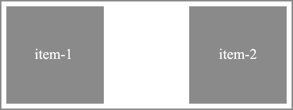

# Float


<!-- xxxxxxxxxxxxxxxxxxxxxxxxxxxxxxxxxxxxxxxxxxxxxxxxxxxxxxx -->
### Обтекание
<!-- xxxxxxxxxxxxxxxxxxxxxxxxxxxxxxxxxxxxxxxxxxxxxxxxxxxxxxx -->
```css:no-line-numbers
div {
	/* Выравнивает элемент по левому краю, все остальные элементы обтекают его по правой стороне */
	float: left;
	/* Выравнивает элемент по правому краю, все остальные элементы обтекают его по левой стороне */
	float: right;
	/* Обтекание элемента не задается */  
	float: none;
}
```

```css:no-line-numbers
div {
	clear: left;   /* Отключить обтекание слева */
	clear: right;  /* Отключить обтекание справа */
	clear: both;   /* Отключить обтекание справа и слева */	
}
```


<!-- xxxxxxxxxxxxxxxxxxxxxxxxxxxxxxxxxxxxxxxxxxxxxxxxxxxxxxx -->
### Пример использования `float` и отключения обтекания (`clearfix`)
<!-- xxxxxxxxxxxxxxxxxxxxxxxxxxxxxxxxxxxxxxxxxxxxxxxxxxxxxxx -->


```html:no-line-numbers
<div class="container">
	<div class="item">item1</div>
	<div class="item">item2</div>
</div>
```

```css:no-line-numbers
.container {
	border: 2px solid blue;
}
.container:after{
	content: "";    /* Содержимое не нужно */
	display: block; /* Для отключения обтекания необходим блочный элемент */
	clear: both;    /* Отключение обтекание справа и слева */
}
.item {
	width: 100px;
	height: 100px;
	background: orange;
	padding: 20px;
	margin: 5px;
}
.item:first-child {
	float: left;   /* Применение обтекания слева */
}
.item:last-child {
	float: right; /* Применение обтекания справа */
}
```


<!-- xxxxxxxxxxxxxxxxxxxxxxxxxxxxxxxxxxxxxxxxxxxxxxxxxxxxxxx -->
### Примеры
<!-- xxxxxxxxxxxxxxxxxxxxxxxxxxxxxxxxxxxxxxxxxxxxxxxxxxxxxxx -->

#### Float Image
<v-iframe
	height="350"
	src="https://codepen.io/Sergeenkov/embed/ReorRW?height=265&theme-id=default&default-tab=html,result"
/>
