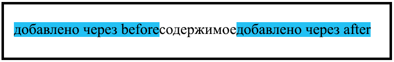

# Псевдоэлементы (before, after)

- `before` - добавляет content перед контентом блока
- `after` - добавляет content после контента блока



```html:no-line-numbers
<div>Содержимое</div>
```

```css:no-line-numbers
div {
	padding: 20px;
	width: 400px;
}
div::before {
	content: "Добавлено через before";
	background-color: white;
}
div::after {
	content: "Добавлено через after";
	background-color: white;
}
```

<!-- xxxxxxxxxxxxxxxxxxxxxxxxxxxxxxxxxxxxxxxxxxxxxxxxxxxxxxx -->
### Примеры
<!-- xxxxxxxxxxxxxxxxxxxxxxxxxxxxxxxxxxxxxxxxxxxxxxxxxxxxxxx -->

<!------------------------------------------------------------->
#### Добавление блока с изображением: `nth-child`, `before`
<!------------------------------------------------------------->
<v-iframe
	height="350"
	src="https://codepen.io/Sergeenkov/embed/VdrpeL?height=265&theme-id=default&default-tab=css,result"
/>

<!------------------------------------------------------------->
#### По наведению на изображение добавляется полупрозрачный слой
<!------------------------------------------------------------->
- **Связка свойств**
- `position`
- `before` / `after`
- `hover`
- `transition`

<v-iframe
	height="350"
	src="https://codepen.io/Sergeenkov/embed/qBNOGry?height=265&theme-id=dark&default-tab=css,result"
/>

<!------------------------------------------------------------->
#### CSS Transition Button: `before`, `after`
<!------------------------------------------------------------->
<v-iframe
	height="350"
	src="https://codepen.io/Sergeenkov/embed/aKprWr?height=265&theme-id=default&default-tab=css,result"
/>
