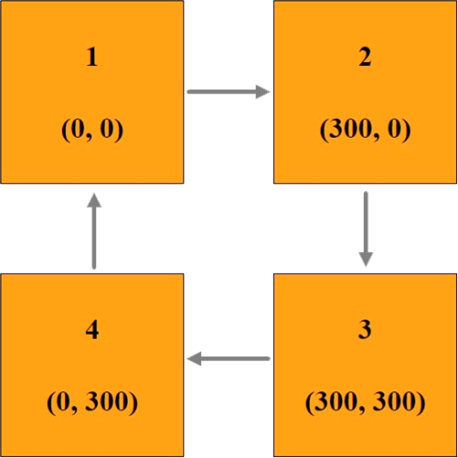

# Анимация в CSS (animation)


<!-- xxxxxxxxxxxxxxxxxxxxxxxxxxxxxxxxxxxxxxxxxxxxxxxxxxxxxxx -->
### animation
<!-- xxxxxxxxxxxxxxxxxxxxxxxxxxxxxxxxxxxxxxxxxxxxxxxxxxxxxxx -->
```css:no-line-numbers
div {
	animation: none 0s ease 0s 1 normal none running;
}
```

#### Параметры
1. `animation-name` - название анимации
2. `animation-duration` - время анимации
3. `animation-timing-function` - функция для вычисления промежуточного состояния анимации
4. `animation-delay` - задержка для анимации
5. `animation-iteration-count` - количество итераций для анимации
6. `animation-direction` - указыает, должно ли движение анимации идти в обратную сторону или нет
7. `animation-fill-mode` - указавает, какие стили должны применяются до начала анимации и после её завершения
8. `animation-play-state` - позводяет проигрывать анимацию или поставить её на паузу



```css:no-line-numbers
@keyframes move{
    0%   { }
    25%  { transform: translate(300px, 0px);   background: red; }
    50%  { transform: translate(300px, 300px); background: gray; }
    75%  { transform: translate(0px, 300px);   background: green; }
    100% { }
}
```

```css:no-line-numbers
div {
	animation-name: move;
	animation-duration: 5s;
	animation-timing-function: linear;
	animation-delay: 0s;
	animation-iteration-count: 1;
	animation-direction: normal;
	animation-fill-mode: none;
	animation-play-state: running;
}
```

```css:no-line-numbers
div {
	border: 1px solid #000;
	width: 200px;
	height: 200px;
	background: orange;
	animation: move 5s infinite; 
}
```


<!-- xxxxxxxxxxxxxxxxxxxxxxxxxxxxxxxxxxxxxxxxxxxxxxxxxxxxxxx -->
### Примеры
<!-- xxxxxxxxxxxxxxxxxxxxxxxxxxxxxxxxxxxxxxxxxxxxxxxxxxxxxxx -->
<v-iframe
	height="350"
	src="https://codepen.io/Sergeenkov/embed/MBwjWE?height=265&theme-id=default&default-tab=css,result"
/>
