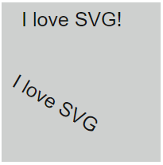

# SVG

- [w3schools.com](https://www.w3schools.com/graphics/svg_intro.asp)
- [yoksel.ru](http://css.yoksel.ru/tags/#sv)


<!-- xxxxxxxxxxxxxxxxxxxxxxxxxxxxxxxxxxxxxxxxxxxxxxxxxxxxxxx -->
### Стилизация на CSS
<!-- xxxxxxxxxxxxxxxxxxxxxxxxxxxxxxxxxxxxxxxxxxxxxxxxxxxxxxx -->
```css:no-line-numbers
svg {
	fill: yellowgreen;
	fill-opacity: 0.9;
	stroke: black;
	stroke-width: 2;
	stroke-opacity: 0.7;
}
svg path {
	d: path('M0,100 L 20,0 80,90 100,0 100,100 Z');
}
```


<!-- xxxxxxxxxxxxxxxxxxxxxxxxxxxxxxxxxxxxxxxxxxxxxxxxxxxxxxx -->
### Прямоугольник: `rectangle`
<!-- xxxxxxxxxxxxxxxxxxxxxxxxxxxxxxxxxxxxxxxxxxxxxxxxxxxxxxx -->

<!-- .............. START ......................... -->
<v-two grow>
<template v-slot:first>

```html:no-line-numbers
<svg viewBox="0 0 100 100">
	<rect
		x="25" y="25"
		width="50px"
		height="50px"
	/>
</svg>
```
</template>
<template v-slot:last>

</template>
</v-two>
<!-- ............... END .......................... -->

<!-- .............. START ......................... -->
<v-two grow>
<template v-slot:first>

```html:no-line-numbers
<svg viewBox="0 0 100 100">
	<rect
		x="25" y="25" rx="10" ry="50"
		width="50px"
		height="50px"
	/>
</svg>
```
</template>
<template v-slot:last>

</template>
</v-two>
<!-- ............... END .......................... -->


<!-- xxxxxxxxxxxxxxxxxxxxxxxxxxxxxxxxxxxxxxxxxxxxxxxxxxxxxxx -->
### Окружность: `circle`, `ellipse`
<!-- xxxxxxxxxxxxxxxxxxxxxxxxxxxxxxxxxxxxxxxxxxxxxxxxxxxxxxx -->

<!-- .............. START ......................... -->
<v-two grow>
<template v-slot:first>

```html:no-line-numbers
<svg viewBox="0 0 100 100">
	<circle cx="50" cy="50" r="25" />
</svg>
```
</template>
<template v-slot:last>

</template>
</v-two>
<!-- ............... END .......................... -->

- `<g></g>` - объединение объектов для задания общих свойств

<!-- .............. START ......................... -->
<v-two grow>
<template v-slot:first>

```html:no-line-numbers
<svg>
	<g stroke="black" stroke-width="3" fill="black">
		<circle cx="50" cy="50" r="5" />
		<circle cx="100" cy="100" r="5" />
	</g>
</svg>
```
</template>
<template v-slot:last>

</template>
</v-two>
<!-- ............... END .......................... -->

<!-- .............. START ......................... -->
<v-two grow>
<template v-slot:first>

```html:no-line-numbers
<svg viewBox="0 0 100 100">
	<ellipse cx="50" cy="50" rx="35" ry="25" />
</svg>
```
</template>
<template v-slot:last>

</template>
</v-two>
<!-- ............... END .......................... -->


<!-- xxxxxxxxxxxxxxxxxxxxxxxxxxxxxxxxxxxxxxxxxxxxxxxxxxxxxxx -->
### Линия: `line`, `polyline`
<!-- xxxxxxxxxxxxxxxxxxxxxxxxxxxxxxxxxxxxxxxxxxxxxxxxxxxxxxx -->

<!-- .............. START ......................... -->
<v-two grow>
<template v-slot:first>

```html:no-line-numbers
<svg viewBox="0 0 100 100">
	<line x1="0" y1="0" x2="50" y2="50" />
</svg>
```
</template>
<template v-slot:last>

</template>
</v-two>
<!-- ............... END .......................... -->

<!-- .............. START ......................... -->
<v-two grow>
<template v-slot:first>

```html:no-line-numbers
<svg viewBox="0 0 100 100">
	<polyline points="0,0 50,50 25,75" />
</svg>
```
</template>
<template v-slot:last>

</template>
</v-two>
<!-- ............... END .......................... -->


<!-- xxxxxxxxxxxxxxxxxxxxxxxxxxxxxxxxxxxxxxxxxxxxxxxxxxxxxxx -->
### Полигон: `polygon`
<!-- xxxxxxxxxxxxxxxxxxxxxxxxxxxxxxxxxxxxxxxxxxxxxxxxxxxxxxx -->
<!-- .............. START ......................... -->
<v-two grow>
<template v-slot:first>

```html:no-line-numbers
<svg viewBox="0 0 100 100">
	<polygon points="0,0 50,50 25,75" />
</svg>
```
</template>
<template v-slot:last>

</template>
</v-two>
<!-- ............... END .......................... -->


<!-- xxxxxxxxxxxxxxxxxxxxxxxxxxxxxxxxxxxxxxxxxxxxxxxxxxxxxxx -->
### Путь: `path`
<!-- xxxxxxxxxxxxxxxxxxxxxxxxxxxxxxxxxxxxxxxxxxxxxxxxxxxxxxx -->
- <b>Доступные команды:</b>
- `M` - moveto<
- `L` - lineto
- `H` - horizontal lineto
- `V` - vertical lineto
- `C` - curveto
- `S` - smooth curveto
- `Q` - quadratic Bézier curve
- `T` - smooth quadratic Bézier curveto
- `A` - elliptical Arc
- `Z` - closepath

<!-- .............. START ......................... -->
<v-two grow>
<template v-slot:first>

```html:no-line-numbers
<svg viewBox="0 0 100 100">
	<path d="M0,100 L50,50 100,100 Z" />
</svg>
```
</template>
<template v-slot:last>

</template>
</v-two>
<!-- ............... END .......................... -->

<!-- .............. START ......................... -->
<v-two grow>
<template v-slot:first>

```html:no-line-numbers
<svg viewBox="0 0 100 100" >
	<path d="M0,100 Q 50,50 100,100"></path>
</svg>
```
</template>
<template v-slot:last>

</template>
</v-two>
<!-- ............... END .......................... -->

- Атрибут `preserveAspectRatio="none"` позволяет поместить фигуру целиком в `viewBox`
- При изменении размера блока svg размер фигуры будет меняться

<!-- .............. START ......................... -->
<v-two grow>
<template v-slot:first>

```html:no-line-numbers
<svg viewBox="0 0 100 100" preserveAspectRatio="none">
	<path d="M0,100 L 20,0 80,90 100,0 100,100 Z"></path>
</svg>
```
</template>
<template v-slot:last>

</template>
</v-two>
<!-- ............... END .......................... -->

<!-- .............. START ......................... -->
<v-two grow>
<template v-slot:first>

```html:no-line-numbers
<svg viewBox="0 0 100 100" preserveAspectRatio="none">
	<path d="
		M0,50 Q 25,0 50,50, 75,100,
		100,50 L100,100 0,100 0,50
	"></path>
</svg>
```
</template>
<template v-slot:last>

</template>
</v-two>
<!-- ............... END .......................... -->


<!-- xxxxxxxxxxxxxxxxxxxxxxxxxxxxxxxxxxxxxxxxxxxxxxxxxxxxxxx -->
### Текст: `text`
<!-- xxxxxxxxxxxxxxxxxxxxxxxxxxxxxxxxxxxxxxxxxxxxxxxxxxxxxxx -->
<!-- .............. START ......................... -->
<v-two grow>
<template v-slot:first>

```html:no-line-numbers
<svg>
	<text x="25" y="30">
		I love SVG!
	</text>
	<text x="45" y="100" transform="rotate(30 20,40)">
		I love SVG
	</text>
</svg>
```
</template>
<template v-slot:last>

</template>
</v-two>
<!-- ............... END .......................... -->

<!-- .............. START ......................... -->
<v-two grow>
<template v-slot:first>

```html:no-line-numbers
<svg>
	<text x="10" y="30">Several lines:
		<tspan x="10" y="60">First line.</tspan>
		<tspan x="10" y="90">Second line.</tspan>
	</text>
</svg>
```
</template>
<template v-slot:last>

</template>
</v-two>
<!-- ............... END .......................... -->

<!-- .............. START ......................... -->
<v-two grow>
<template v-slot:first>

```html:no-line-numbers
<svg>
	<a xlink:href="https://www.yandex.ru/" target="_blank">
		<text x="10" y="30">Link</text>
	</a>
</svg>
```
</template>
<template v-slot:last>

</template>
</v-two>
<!-- ............... END .......................... -->


<!-- xxxxxxxxxxxxxxxxxxxxxxxxxxxxxxxxxxxxxxxxxxxxxxxxxxxxxxx -->
### Примеры
<!-- xxxxxxxxxxxxxxxxxxxxxxxxxxxxxxxxxxxxxxxxxxxxxxxxxxxxxxx -->
<v-iframe
	height="350"
	src="https://codepen.io/Sergeenkov/embed/pKYWaQ?height=265&theme-id=default&default-tab=css,result"
/>
