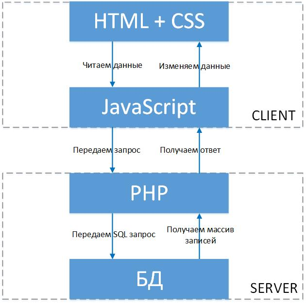

# AJAX

<!-- xxxxxxxxxxxxxxxxxxxxxxxxxxxxxxxxxxxxxxxxxxxxxxxxxxxxxxx -->
### Архитектура клиент-сервер
<!-- xxxxxxxxxxxxxxxxxxxxxxxxxxxxxxxxxxxxxxxxxxxxxxxxxxxxxxx -->



<!-- xxxxxxxxxxxxxxxxxxxxxxxxxxxxxxxxxxxxxxxxxxxxxxxxxxxxxxx -->
### Способы отправки запроса на сервер
<!-- xxxxxxxxxxxxxxxxxxxxxxxxxxxxxxxxxxxxxxxxxxxxxxxxxxxxxxx -->
- XMLHttpRequest (не используют в явном виде, создаются обертки)
- Fetch (нативный, полифил для IE)
- Axios


<!-- xxxxxxxxxxxxxxxxxxxxxxxxxxxxxxxxxxxxxxxxxxxxxxxxxxxxxxx -->
### Формат JSON
<!-- xxxxxxxxxxxxxxxxxxxxxxxxxxxxxxxxxxxxxxxxxxxxxxxxxxxxxxx -->
- [JSON каталога товаров на Github Gist (Фрукты)](https://gist.githubusercontent.com/it-school58/90451ec6dd32b4745882f1d3b8b107eb/raw/82d369a0a61622eef9b83bfe0e653c780d593c6f/fruit-catalog.json)
- [JSON каталога товаров на Github Gist (Гитары)](https://gist.githubusercontent.com/it-school58/a487f4a0ff7d1c9a0697cb567ee9d5cf/raw/7f7534ee99e481cf747311401849e42a2222eb3c/guitar-catalog.json)


```json::no-line-numbers
[
    {
        "name": "Apple",
        "count": 100
    },
    {
        "name": "Orange",
        "count": 200
    },
    {
        "name": "Lemon",
        "count": 300
    }
]
```

<!-- xxxxxxxxxxxxxxxxxxxxxxxxxxxxxxxxxxxxxxxxxxxxxxxxxxxxxxx -->
### Метод Fetch
<!-- xxxxxxxxxxxxxxxxxxxxxxxxxxxxxxxxxxxxxxxxxxxxxxxxxxxxxxx -->
[Fetch](https://learn.javascript.ru/fetch)

```js:no-line-numbers
// fetch возвращает promise
const promise = fetch('url для отправки запроса');
```


<!-- .............. START ......................... -->
<v-two>
<template v-slot:first>

```js:no-line-numbers
// promise
fetch('https://swapi.co/api/people/1/')
    .then(res => res.json())
    .then(body => console.log(body))
    .catch(error => console.log(error.message))
```
</template>
<template v-slot:last>

```js:no-line-numbers
// async
const getResource = async (url) => {
    const res = await fetch(url);
    return await res.json();
}

getResource('https://swapi.co/api/people/1/')
    .then(body => console.log(body))
```
</template>
</v-two>
<!-- ............... END .......................... -->

