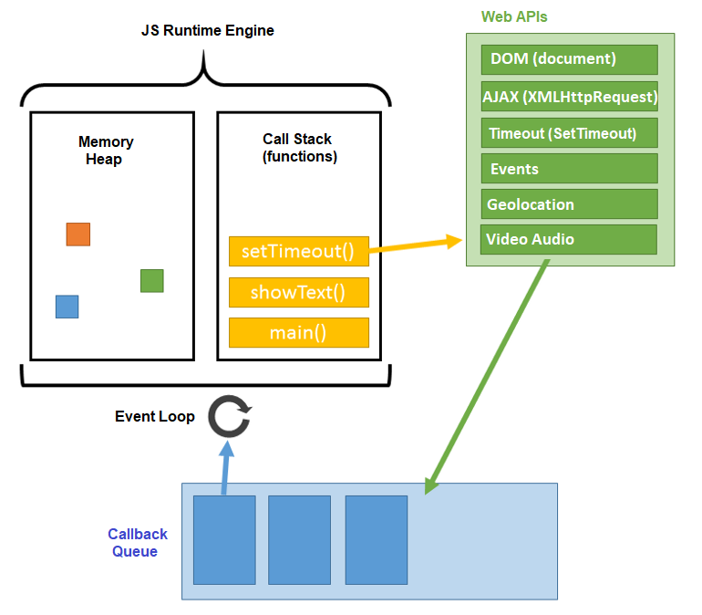

# Event Loop

- [Статья на MDN](https://developer.mozilla.org/ru/docs/Web/JavaScript/EventLoop)
- [Статья на Habr](https://habr.com/ru/post/461401/)
- [Статья на Medium](https://medium.com/@stasonmars/полное-понимание-синхронного-и-асинхронного-javascript-с-async-await-ba5f47f4436)

<!-- xxxxxxxxxxxxxxxxxxxxxxxxxxxxxxxxxxxxxxxxxxxxxxxxxxxxxxx -->
### Описание
<!-- xxxxxxxxxxxxxxxxxxxxxxxxxxxxxxxxxxxxxxxxxxxxxxxxxxxxxxx -->
- Движок браузера выполняет JavaScript в одном потоке. Он не может поставить обработку события на паузу, переключиться на другое событие, а после возобновить выполнение первого. Все события обрабатываются последовательно и каждое до конца

1. Сначала выполняется синхронный код
2. Потом выполняется асинхронный код: setTimeout, AJAX-запросы к серверу и т.д.

```js:no-line-numbers
console.log(1);

setTimeout(function() { 
	console.log(2); 
}, 0);

console.log(3);

// => 1, 3, 2
```




<!-- xxxxxxxxxxxxxxxxxxxxxxxxxxxxxxxxxxxxxxxxxxxxxxxxxxxxxxx -->
### Эволюция методов по работе с асинхронным кодом
<!-- xxxxxxxxxxxxxxxxxxxxxxxxxxxxxxxxxxxxxxxxxxxxxxxxxxxxxxx -->

<!------------------------------------------------------------->
#### 1. Callback-функции
<!------------------------------------------------------------->
```js:no-line-numbers
setTimeout(function() {
	// Асинхронный код
}, 1000);
```

```js:no-line-numbers
element.addEventListener('click', function() {
	// Асинхронный код
})
```

<!------------------------------------------------------------->
#### 2. Promise
<!------------------------------------------------------------->
```js:no-line-numbers
fetch('url')
    .then(res => res.json())
    .then(body => console.log(body))
```

<!------------------------------------------------------------->
#### 3. Генераторы
<!------------------------------------------------------------->
```js:no-line-numbers
function getApi() {
	const response = yield fetch('url');
	const data = yield response.json();
	return data;
}
```

<!------------------------------------------------------------->
#### 4. Асинхронные функции
<!------------------------------------------------------------->
```js:no-line-numbers
async function getApi(id) {
    const response = await fetch('url');
    const data = await response.json();
    return data;
}
```
