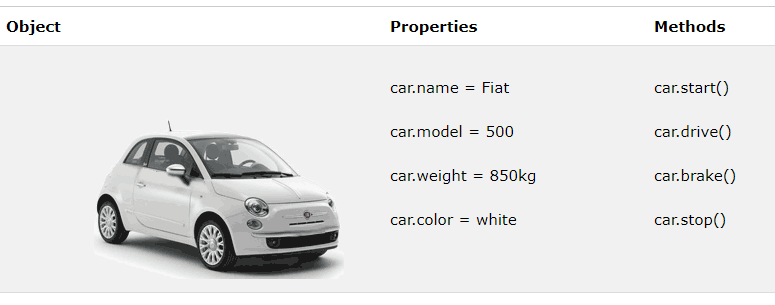

# Объекты



```js:no-line-numbers
const user = {
	name: 'Tony',
	email: 'tony@mail.com',
	age: 25,
	address: {
		street: '555 Some st',
		city: 'Boston'
	},
	getData() {
		return this.name + ' ' + this.email;
	}
}

console.log(user.name);
console.log(user.address.street);
console.log(user.getData());
```

<!-- xxxxxxxxxxxxxxxxxxxxxxxxxxxxxxxxxxxxxxxxxxxxxxxxxxxxxxx -->
### Цикл `for..in` для перебора ключей объекта
<!-- xxxxxxxxxxxxxxxxxxxxxxxxxxxxxxxxxxxxxxxxxxxxxxxxxxxxxxx -->
```js:no-line-numbers
for(let key in obj) {
	console.log(key);      // Ключи 
	console.log(obj[key]); // Значения
} 
```
